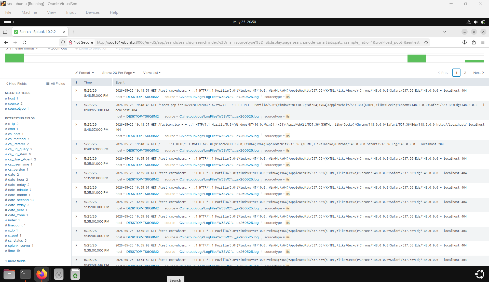
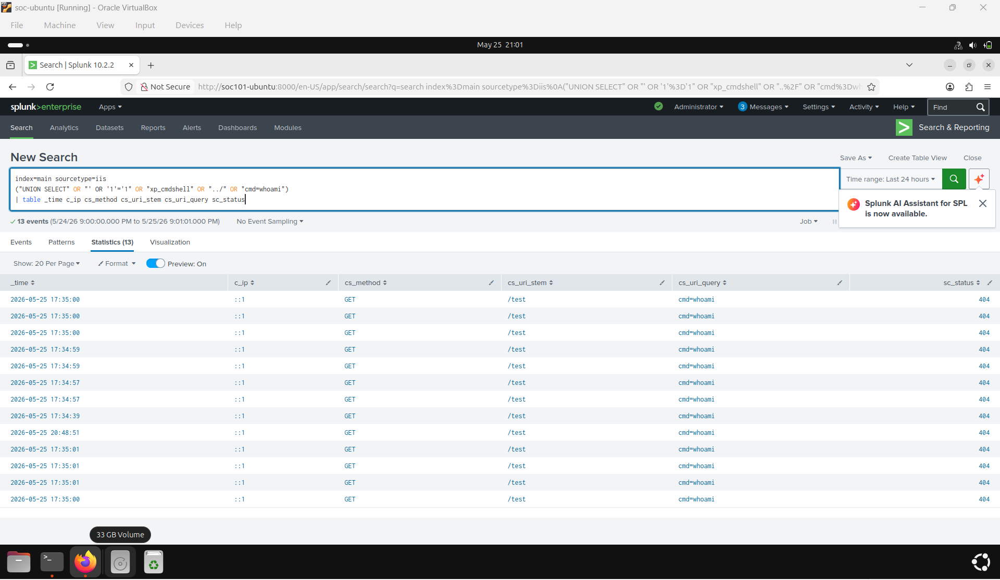
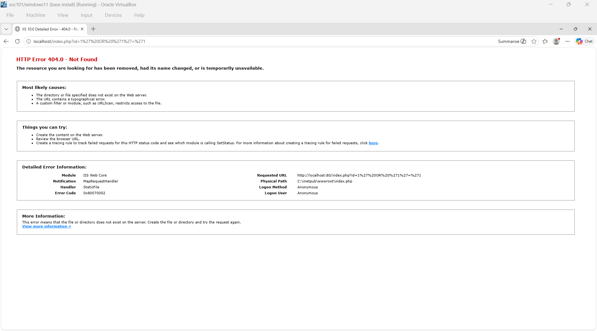
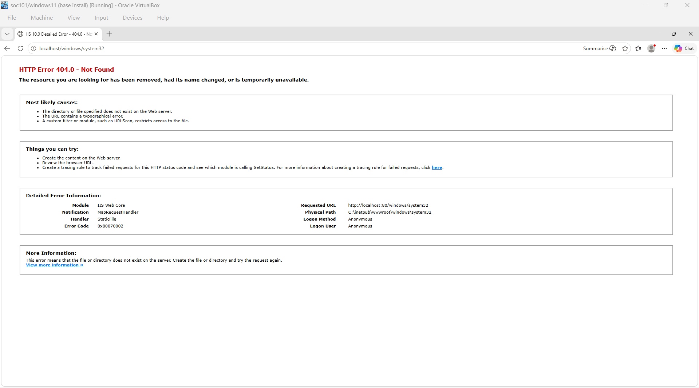
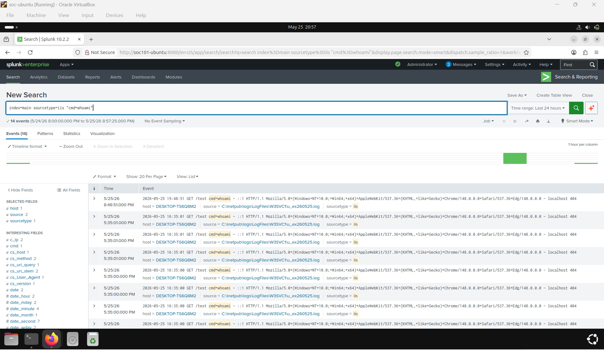
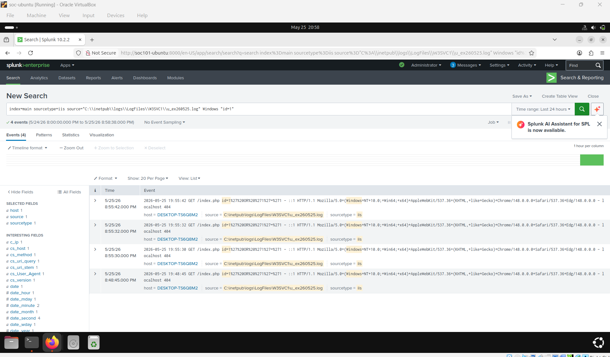
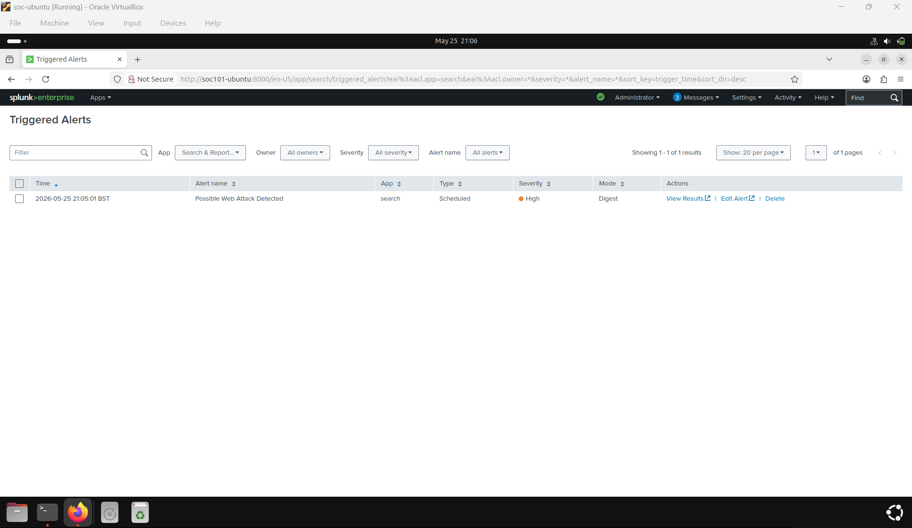

# Splunk Web Attack Detection Lab

## Overview

This project demonstrates a SOC-style web attack detection lab using:

- Splunk Enterprise on Ubuntu
- Windows 11 IIS Web Server
- Splunk Universal Forwarder
- IIS Log Monitoring
- SQL Injection Detection
- Command Injection Detection
- Directory Traversal Detection
- Alert Creation and Investigation

The objective was to simulate common web attacks and detect them using Splunk SPL queries and alerts.

---

# Lab Architecture

- Ubuntu VM running Splunk Enterprise
- Windows 11 VM running IIS
- Splunk Universal Forwarder installed on Windows
- IIS logs forwarded into Splunk

---

# Technologies Used

- Splunk Enterprise
- Splunk Universal Forwarder
- Ubuntu Linux
- Windows 11
- IIS Web Server
- PowerShell
- VirtualBox

---

# Skills Demonstrated

- SIEM administration
- Log ingestion troubleshooting
- Detection engineering
- SPL query writing
- SOC alert creation
- Threat hunting
- Web attack detection
- IIS log analysis

---

# Splunk Deployment

Installed and configured Splunk Enterprise on Ubuntu Linux.

Verified:
- Splunk service operational
- Web interface accessible
- Search functionality working



---

# Challenges Faced During Setup

## Log Collection and Forwarding Troubleshooting

One of the biggest challenges was understanding how IIS logs were being generated and forwarded into Splunk.

Issues faced:
- Initially no events appeared in Splunk
- Incorrect paths and search filters
- Understanding IIS log structure
- Learning how Splunk indexes and searches logs

Troubleshooting steps:
- Verified IIS logging was enabled
- Confirmed log file location:
  ```text
  C:\inetpub\logs\LogFiles\
  ```
- Tested multiple SPL queries
- Used raw searches before refining detections
- Learned how sourcetypes affect parsing

This part was genuinely exciting because it felt like performing real SOC troubleshooting and threat hunting work.

---

# IIS Log Investigation

After troubleshooting, IIS events successfully appeared inside Splunk.

The logs contained:
- IP addresses
- URI requests
- Query strings
- HTTP methods
- Status codes



---

# Attack Simulations

## 1. SQL Injection Simulation

Simulated SQL injection attempts against the IIS web server.

Payload used:

```text
http://localhost/index.php?id=1'%20OR%20'1'%3D'1
```

Observed:
- HTTP 404 responses
- Suspicious query strings
- Injection patterns inside IIS logs



---

## 2. Command Injection Simulation

Simulated command injection attempts using:

```text
http://localhost/test?cmd=whoami
```

This generated suspicious requests inside IIS logs.


---

## 3. Directory Traversal Simulation

Simulated directory traversal attempts:

```text
http://localhost/windows/system32
```

This helped demonstrate detection of suspicious path access attempts.



---

# Threat Hunting Queries

## Searching for Command Injection Activity

Used SPL searches to identify suspicious command execution attempts:

```spl
index=main sourcetype=iis "cmd=whoami"
```



---

## SQL Injection Detection Query

Built a detection query to identify common web attack indicators.

```spl
index=main sourcetype=iis
("UNION SELECT" OR "' OR '1'='1" OR "xp_cmdshell" OR "../" OR "cmd=whoami")
| table _time c_ip cs_method cs_uri_stem cs_uri_query sc_status
```

The query successfully identified:
- SQL injection attempts
- Command injection attempts
- Directory traversal patterns



---

# Alert Engineering

Created a scheduled Splunk alert named:

```text
Possible Web Attack Detected
```

Alert configuration:
- Severity: High
- Trigger condition: Results greater than 0
- Scheduled execution
- Digest mode enabled

Successfully triggered alerts from simulated attacks.



---

# Lessons Learned

This lab improved my understanding of:

- SIEM workflows
- Splunk SPL searching
- Detection engineering
- Web attack indicators
- IIS log analysis
- SOC investigation methodology
- Threat hunting
- Alert creation and tuning

Most importantly, I learned that troubleshooting infrastructure and data ingestion is a major part of real SOC work before detections can even function properly.

---

# Future Improvements

Planned future improvements:

- Integrate Sysmon logging
- Add PowerShell detections
- Build Splunk dashboards
- Create MITRE ATT&CK mappings
- Forward Windows Event Logs
- Add brute-force detection
- Recreate detections inside Microsoft Sentinel

---

# MITRE ATT&CK Mapping

| Technique | Description |
|---|---|
| T1190 | Exploit Public-Facing Application |
| T1059 | Command and Scripting Interpreter |
| T1006 | Path Traversal |
| T1505 | Server Software Component |

---

# Author

Stoyan Vlahov

GitHub:
https://github.com/Stoyan898
