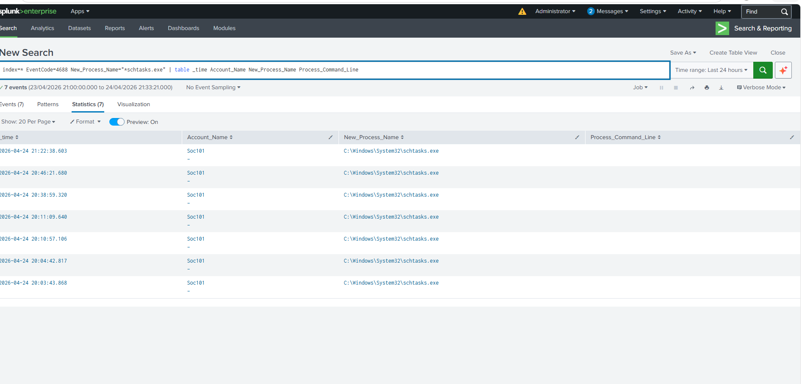
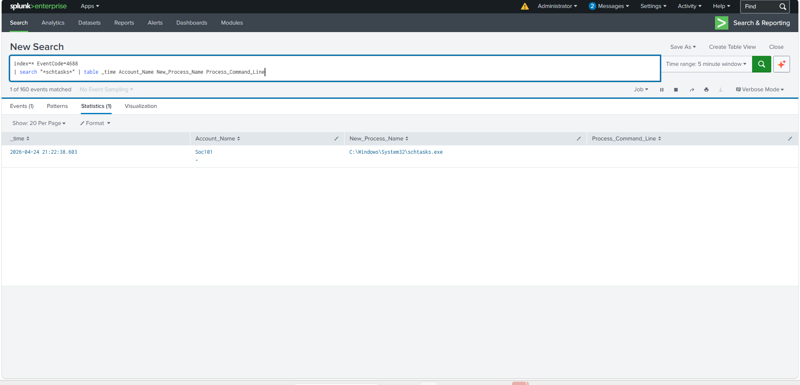
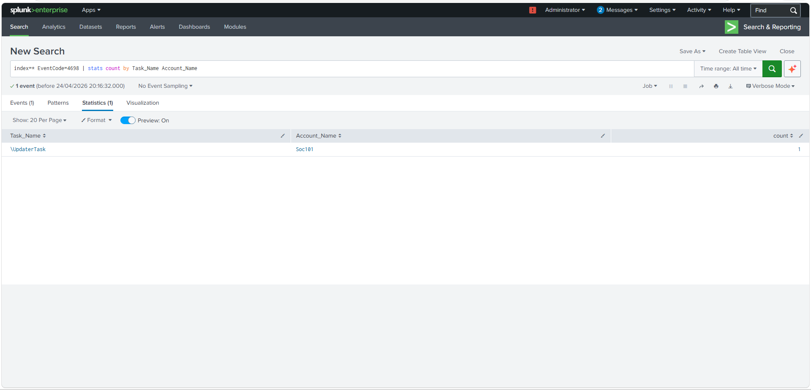
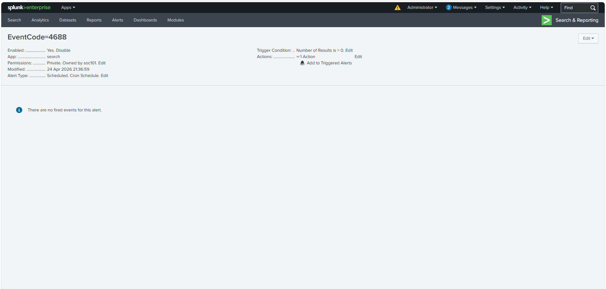

# Persistence Detection - Scheduled Tasks (schtasks)

## 🎯 Objective
Detect persistence activity using scheduled tasks (`schtasks.exe`) in Splunk.

---

## 🧪 Attack Simulation

A scheduled task was created using:
schtasks /create /sc minute /mo 5 /tn "UpdaterTask" /tr "notepad.exe"

This simulates MITRE ATT&CK:
- T1053 - Scheduled Task/Job

---

## 📊 Log Source

- Windows Security Logs
- Event ID: **4688 (Process Creation)**

---

## 🔍 Detection Queries

### Basic Detection (Working)
index=* EventCode=4688 New_Process_Name="*schtasks.exe"
| table _time Account_Name New_Process_Name

---

### Attempted Command-Line Detection (Failed)

index=* EventCode=4688 Process_Command_Line="schtasks"

❌ No results due to missing command-line logging.

---

## 🚨 Alert Configuration

- Trigger condition: Number of results > 0
- Schedule: Cron-based
- Action: Add to Triggered Alerts

---

## 📸 Screenshots

### schtasks detection in Splunk

### Detection query

### Missing command line

### Alert configuration

---

## ⚠️ Challenges

- `Process_Command_Line` field was empty
- Limited detection visibility

---

## 🧠 Key Learning

- Process creation logs (4688) can detect execution
- Command-line logging must be enabled for deeper detection
- Detection engineering often requires improving telemetry

---

## 🔍 Detection – Process Execution (Event ID 4688)

Splunk query used to detect execution of schtasks.exe:
index=* EventCode=4688 "schtasks.exe"
| table _time Account_Name New_Process_Name
This confirms that the scheduled task tool was executed.

## 🔐 Detection – Scheduled Task Creation (Event ID 4698)

Splunk query used to detect persistence:
index=* EventCode=4698
| table _time Account_Name Task_Name
This confirms that a scheduled task was created on the system.
## ⚠️ Challenge – Missing Command Line Data

Although command-line logging was enabled:

- `Process Command Line` was not consistently populated in Event ID 4688
- Some events contained the field, others did not

### Solution:
Detection was adjusted to:
- Focus on process execution (4688)
- Use Event ID 4698 for reliable persistence detection

- ## 🧪 Attack Simulation

---

## 🔍 Detection – Process Execution (Event ID 4688)

---

## 🔬 Event Analysis

---

## 🔐 Detection – Persistence (Event ID 4698)

### Key Learning:
Log data can be incomplete – detection must adapt.
